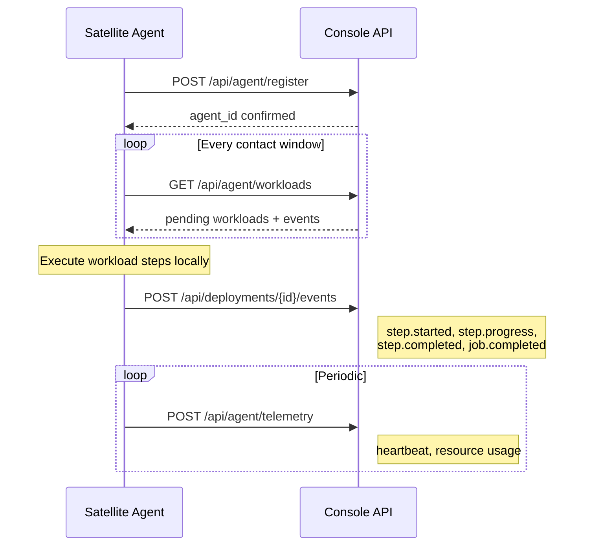

# Operator Agent

The RotaStellar Operator Agent is a lightweight runtime that executes compute workloads on satellites. It uses a **pull-based protocol** designed for intermittent connectivity — agents operate autonomously and sync with Mission Control during contact windows.

<Info>
  The Operator Agent is open source. See the [GitHub repository](https://github.com/rotastellar/rotastellar-agent) for the Rust SDK.
</Info>

## Architecture

The agent runs on the satellite (or in simulation on a development machine). It communicates exclusively with the Console API — there is no direct connection to the CAE planner.

## How It Works

1. **Poll** — Agent checks for pending workloads during contact windows
2. **Execute** — Agent runs workload steps locally on the satellite
3. **Report** — Agent streams execution events back to Console
4. **Telemetry** — Agent sends periodic health/status heartbeats

The protocol is pull-based by design. Satellites have intermittent ground station contact windows — typically a few minutes per orbit. The agent polls when connectivity is available, executes autonomously, and reports results on the next pass.

## Deployment Modes

| Mode | Description |
|------|-------------|
| `simulated` | Console generates events from CAE plan data. No agent involved. Good for testing and demos. |
| `live` | Agent polls, executes, and reports events. Real or hardware-in-the-loop execution. |

## Event Types

The agent uses the same event format as the [CAE simulator](/cae/understanding-plans). Events track the full lifecycle of a workload execution:

| Event | Description |
|-------|------------|
| `job.accepted` | Workload received and queued |
| `placement.decided` | Step placement decision (on-board vs ground) |
| `plan.created` | Execution plan finalized |
| `step.started` | Compute step begins |
| `step.progress` | Progress update (25%, 50%, 75%) |
| `step.completed` | Compute step finished |
| `transfer.started` | Data transfer initiated |
| `transfer.completed` | Data transfer finished |
| `checkpoint.saved` | State checkpoint persisted |
| `security.encrypted` | Data encrypted |
| `job.completed` | All steps finished successfully |
| `job.failed` | Execution failed |

<CardGroup cols={3}>
  <Card title="Protocol Spec" icon="file-contract" href="/agent/protocol">
    Full protocol specification with auth, lifecycle, and error handling
  </Card>
  <Card title="Rust SDK" icon="rust" href="/agent/rust-sdk">
    Build agents with the Rust crate
  </Card>
  <Card title="Quickstart" icon="bolt" href="/agent/quickstart">
    Run your first simulation in 5 minutes
  </Card>
</CardGroup>
