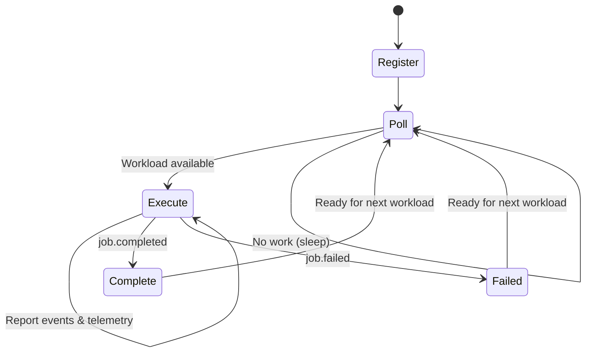

# Agent Protocol Specification

**Version:** 0.1.0

The RotaStellar Agent Protocol defines how satellite-side agents communicate with the Console API. It is a **pull-based** protocol designed for intermittent satellite connectivity.

## Authentication

All agent requests authenticate via API key in the `X-API-Key` header. The agent identifies itself via the `X-Agent-ID` header.

```
X-API-Key: rs_live_...
X-Agent-ID: sat-25544
```

API keys are created in Mission Control under **Developer > API Keys**. Keys are hashed (SHA-256) server-side and compared against stored hashes. Keys can be revoked at any time from the Console.

## Agent Lifecycle



### 1. Register

The agent registers with the Console on first startup. This creates or updates an agent record.

```
POST /api/agent/register
```

**Request:**
```json
{
  "agent_id": "sat-25544",
  "satellite_id": "25544",
  "satellite_name": "ISS (ZARYA)",
  "agent_version": "0.1.0"
}
```

**Response (201):**
```json
{
  "id": "sat-25544",
  "status": "idle"
}
```

If the `agent_id` already exists for this user, the record is updated (upsert).

### 2. Poll for Workloads

The agent polls periodically for pending deployments assigned to its satellite.

```
GET /api/agent/workloads
```

**Response (200) — Work available:**
```json
{
  "plan_id": "abc-123",
  "deployment_id": "dep-456",
  "satellite_id": "25544",
  "plan_data": { ... },
  "events": [
    {
      "type": "job.accepted",
      "timestamp": "2026-03-07T12:00:00Z",
      "job_id": "preset-001",
      "payload": { "preset": "split-learning", "steps": 8 }
    }
  ]
}
```

**Response (204) — No work available.**

The agent should sleep for `poll_interval_s` and retry.

The server returns the oldest pending deployment where:
- `mode = 'live'`
- `satellite_id` matches the agent's registered satellite
- `status = 'pending'`

On dispatch, the server updates the deployment status to `dispatched`.

### 3. Report Events

During execution, the agent reports events as they occur.

```
POST /api/deployments/{deployment_id}/events
```

**Request:**
```json
{
  "type": "step.completed",
  "timestamp": "2026-03-07T14:23:45Z",
  "job_id": "preset-001",
  "step_id": "feature_extraction",
  "payload": {
    "duration_s": 180,
    "location": "onboard",
    "data_output_mb": 10.5
  }
}
```

**Response (201):**
```json
{
  "id": "evt-789"
}
```

The server stores the event and updates the deployment status based on event type:
- `job.accepted` (when `dispatched`) → deployment status = `running`
- `job.completed` → deployment status = `completed`
- `job.failed` → deployment status = `failed`

### 4. Report Telemetry

Agents send periodic heartbeats with health data.

```
POST /api/agent/telemetry
```

**Request:**
```json
{
  "agent_id": "sat-25544",
  "status": "executing",
  "timestamp": "2026-03-07T14:23:45Z",
  "cpu_percent": 67.5,
  "memory_mb": 128.0,
  "battery_percent": 82.0,
  "temperature_c": 34.2
}
```

**Response (200):**
```json
{
  "ok": true
}
```

All fields except `agent_id`, `status`, and `timestamp` are optional.

## Event Types

All events follow this structure:

```json
{
  "type": "<event_type>",
  "timestamp": "<ISO 8601>",
  "job_id": "<string>",
  "step_id": "<string | null>",
  "payload": { ... }
}
```

### Lifecycle Events

| Type | Description | Payload |
|------|-------------|---------|
| `job.accepted` | Workload received and queued | `preset`, `category`, `steps`, `security` |
| `plan.created` | Execution plan finalized | `segments`, `windows_used`, `total_duration_s` |
| `job.completed` | All steps finished successfully | `total_duration_s`, `status`, `delivery_confidence` |
| `job.failed` | Execution failed | `total_duration_s`, `status` |

### Placement Events

| Type | Description | Payload |
|------|-------------|---------|
| `placement.decided` | Step placement decision | `location` (onboard/ground), `reason` |

### Compute Events

| Type | Description | Payload |
|------|-------------|---------|
| `step.started` | Compute step begins | `location`, `window`, `window_label` |
| `step.progress` | Progress update | `percent` (25, 50, 75) |
| `step.completed` | Compute step finished | `duration_s`, `location`, `data_output_mb` |

### Transfer Events

| Type | Description | Payload |
|------|-------------|---------|
| `transfer.started` | Data transfer initiated | `type`, `raw_data_mb`, `total_transfer_mb`, `fec_scheme` |
| `transfer.pass_started` | Ground station pass begins | `ground_station`, `station_name`, `elevation_peak_deg` |
| `transfer.progress` | Transfer progress | `data_transferred_mb`, `total_mb` |
| `transfer.pass_completed` | Pass finished | `data_transferred_mb`, `ground_station` |
| `transfer.completed` | All transfers done | `total_transferred_mb`, `duration_s` |
| `transfer.retransmission` | Blocks retransmitted (BER) | `blocks_retransmitted`, `ber` |

### Security Events

| Type | Description | Payload |
|------|-------------|---------|
| `security.encrypted` | Data encrypted | `algorithm`, `data_mb` |
| `security.key_exchange` | Key exchange performed | `duration_s`, `encryption` |

### Checkpoint Events

| Type | Description | Payload |
|------|-------------|---------|
| `checkpoint.saved` | State persisted | `checkpoint_number`, `progress_fraction` |
| `checkpoint.predicted` | Hazard prediction generated | `hazards_count`, `checkpoints_count`, `next_hazard`, `max_safe_window_s`, `overhead_fraction` |

### Orbital Compute Primitive Events

Eclipse, window, and pass steps emit specialized events. See [Orbital Compute Primitives](/cae/orbital-primitives) for details.

| Type | Description | Payload |
|------|-------------|---------|
| `eclipse_step.started` | Eclipse step begins | `energy_budget_j`, `eclipse_policy`, `actual_battery_wh` |
| `eclipse_step.completed` | Eclipse step finished | `energy_consumed_j`, `actual_battery_wh`, `actual_temperature_c` |
| `window_step.started` | Window step begins | `planned_tier`, `quality_tiers`, `actual_battery_percent` |
| `window_step.degraded` | Tier downgraded | `from_tier`, `to_tier`, `reason` |
| `window_step.completed` | Window step finished | `achieved_tier`, `output_quality`, `degradations` |
| `pass_step.started` | Pass step begins | `sequence_index`, `sequence_total`, `actual_battery_percent` |
| `pass_step.completed` | Pass step finished | `sequence_index`, `sequence_total`, `merge_strategy` |

### Constellation Events

Multi-satellite DAG orchestration events. See [Constellation Execution](/agent/constellation) for details.

| Type | Description | Payload |
|------|-------------|---------|
| `constellation.step_assigned` | Step assigned to satellite | `step_id`, `step_name`, `satellite_id`, `window_id` |
| `constellation.step_started` | Agent began executing step | `step_id`, `actual_battery_percent` |
| `constellation.step_completed` | Step finished | `step_id`, `duration_s`, `actual_battery_percent` |
| `constellation.failover` | Step failed, reassigning | `step_id`, `from_satellite`, `to_satellite`, `reason` |
| `constellation.satellite_complete` | All assigned steps done | `satellite_id`, `completed_count` |

### ISL Transfer Events

| Type | Description | Payload |
|------|-------------|---------|
| `isl_transfer.started` | ISL transfer initiated | `src_satellite`, `dst_satellite`, `data_mb`, `hops`, `route` |
| `isl_transfer.hop_completed` | One ISL hop done | `from`, `to`, `data_mb`, `quality`, `latency_ms`, `bw_mbps` |
| `isl_transfer.completed` | Full transfer done | `total_time_s`, `total_data_mb`, `hops`, `reliability` |

## Error Handling

All error responses follow this format:

```json
{
  "error": "Human-readable error message"
}
```

| Status | Meaning |
|--------|---------|
| 400 | Invalid request body |
| 401 | Missing or invalid API key |
| 403 | API key valid but insufficient permissions |
| 404 | Resource not found |
| 409 | Conflict (e.g., deployment already dispatched) |
| 429 | Rate limited |
| 500 | Server error |

## Rate Limits

| Endpoint | Limit |
|----------|-------|
| Poll | Max 1 request per 10 seconds per agent |
| Events | Max 100 events per minute per deployment |
| Telemetry | Max 1 request per 30 seconds per agent |

## Versioning

The protocol version is included in the `User-Agent` header:

```
User-Agent: rotastellar-agent/0.1.0
```

Breaking changes will increment the minor version until 1.0. After 1.0, semantic versioning applies.
