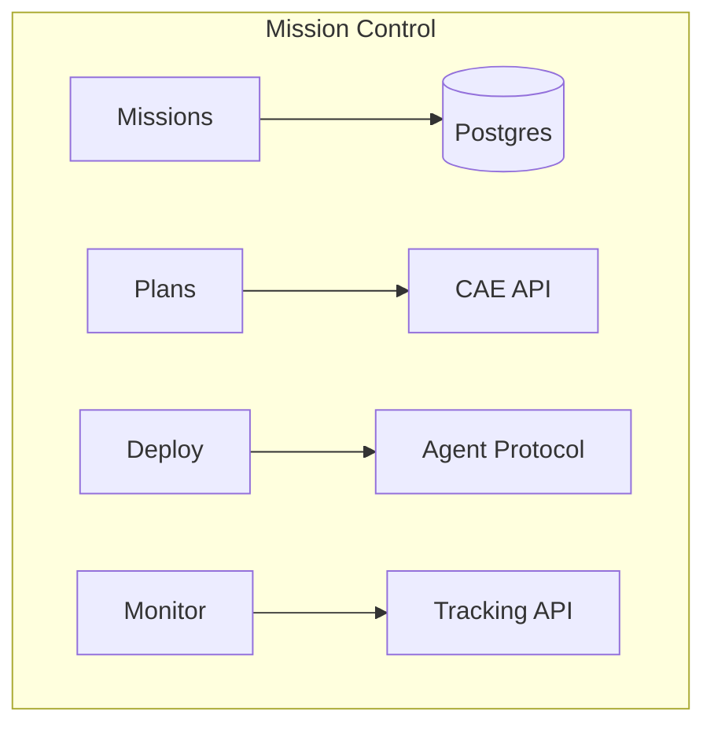

# Mission Control

Mission Control is the RotaStellar operations console. It provides a complete workflow for planning, deploying, and monitoring compute workloads on satellites.

<Info>
  Access Mission Control at [console.rotastellar.com](https://console.rotastellar.com).
</Info>

## Capabilities

### Missions

Organize your satellite operations into missions. Each mission groups related plans, deployments, and activity into a single workspace.

### Plan Builder

Create execution plans using CAE presets or custom workload DAGs. The plan builder shows:

- Orbital environment (eclipse fraction, ground station passes)
- Placement decisions (on-board vs ground compute)
- Transfer schedule (downlink/uplink with FEC overhead)
- Error budget and delivery confidence
- Cost estimation
- Full execution timeline

### Deployments

Deploy plans in **simulated** or **live** mode:

- **Simulated** — Console generates events from CAE plan data with configurable speed. No agent required.
- **Live** — A satellite agent picks up the deployment and reports events in real-time.

Track deployment status: `pending` → `dispatched` → `running` → `completed`.

### Constellations

Group satellites into constellations for fleet operations. Add satellites by NORAD ID and view orbital parameters.

### Monitor

Real-time satellite tracking with an interactive 3D globe. View satellite positions, orbits, and ground station coverage.

### Developer Tools

- **API Keys** — Create and manage keys for agent authentication and API access
- **Usage** — Track API usage and billing
- **Settings** — Profile, preferences (timezone, units, globe style)

## Architecture

Mission Control is built on:

- **Next.js** — React-based web application
- **CAE API** — Constraint-Aware Execution engine for orbital compute planning
- **RotaStellar API** — Satellite tracking, feasibility analysis, orbital intelligence
- **Operator Agent** — Pull-based protocol for satellite-side execution

