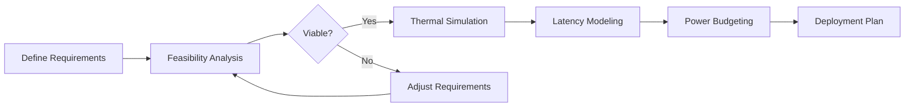

# Planning Tools

<Info>
  **Status:** Early Access — [Request API key](https://rotastellar.com/developers)
</Info>

Planning Tools help you evaluate the feasibility of orbital compute deployments before committing resources. Answer critical questions about thermal management, latency, power, and cost.

## Capabilities

<CardGroup cols={2}>
  <Card title="Feasibility Analysis" icon="calculator" href="/planning/feasibility">
    Evaluate whether your workload is suitable for orbital compute
  </Card>
  <Card title="Thermal Simulation" icon="temperature-high" href="/planning/thermal">
    Model heat rejection and thermal cycles in orbit
  </Card>
  <Card title="Latency Simulation" icon="clock" href="/planning/latency">
    Predict network latency based on orbital geometry
  </Card>
  <Card title="Power Budgeting" icon="bolt" href="/planning/power">
    Plan power generation and consumption across orbit
  </Card>
</CardGroup>

## Quick Start

<CodeGroup>
```python Python
from rotastellar import RotaStellarClient

client = RotaStellarClient(api_key="rs_...")

# Comprehensive feasibility analysis
result = client.planning.analyze(
    workload="ai_inference",
    compute_tflops=100,
    storage_tb=10,
    bandwidth_gbps=1
)

print(f"Recommendation: {result.recommendation}")
print(f"Optimal orbit: {result.orbit}")
print(f"Monthly cost: ${result.cost_monthly}")
print(f"Power required: {result.power_kw} kW")
```

```typescript Node.js
import { RotaStellarClient } from '@rotastellar/sdk';

const client = new RotaStellarClient({ apiKey: 'rs_...' });

const result = await client.planning.analyze({
  workload: 'ai_inference',
  computeTflops: 100,
  storageTb: 10,
  bandwidthGbps: 1
});

console.log(`Recommendation: ${result.recommendation}`);
console.log(`Optimal orbit: ${result.orbit}`);
console.log(`Monthly cost: $${result.costMonthly}`);
```

```bash cURL
curl https://api.rotastellar.com/v1/planning/analyze \
  -H "Authorization: Bearer rs_your_api_key" \
  -H "Content-Type: application/json" \
  -d '{
    "workload": "ai_inference",
    "compute_tflops": 100,
    "storage_tb": 10,
    "bandwidth_gbps": 1
  }'
```
</CodeGroup>

## Workflow

A typical planning workflow:



## Orbit Options

| Orbit Type | Altitude | Period | Use Cases |
|------------|----------|--------|-----------|
| LEO | 300-600 km | 90-100 min | Low latency, Earth observation |
| MEO | 2,000-35,000 km | 2-24 hr | Navigation, regional coverage |
| GEO | 35,786 km | 24 hr | Fixed coverage, broadcasting |
| HEO | Variable | Variable | Polar coverage, specific regions |

## Next Steps

<CardGroup cols={2}>
  <Card title="Feasibility Analysis" icon="calculator" href="/planning/feasibility">
    Start with a comprehensive feasibility check
  </Card>
  <Card title="API Reference" icon="code" href="/api-reference/planning/analyze-feasibility">
    View the full API specification
  </Card>
</CardGroup>
